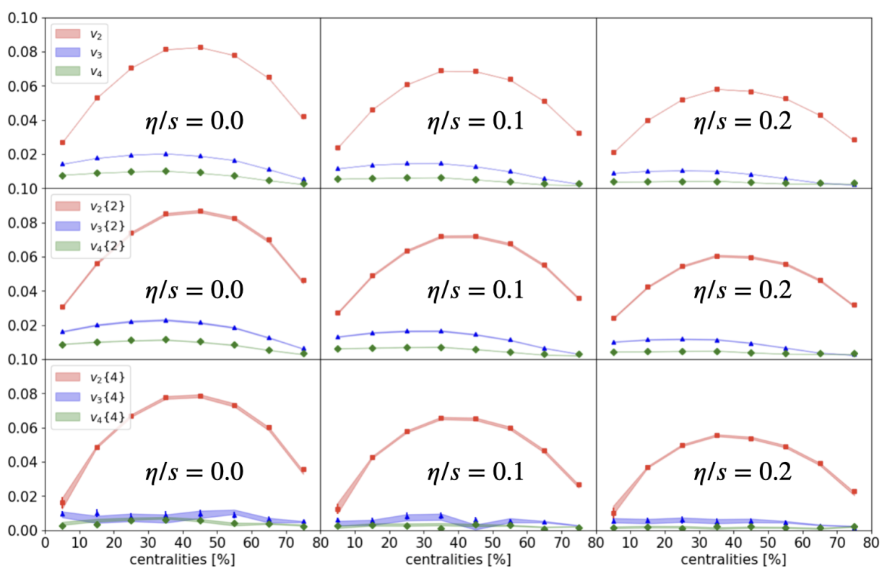
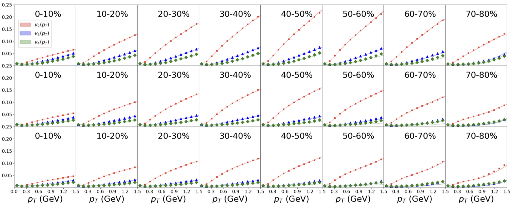
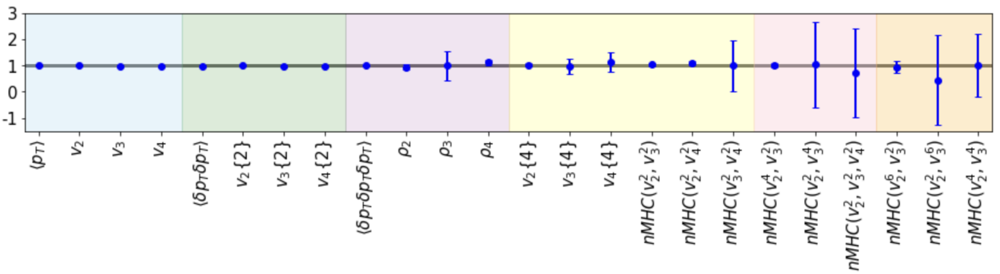

# Introduction

The multistage approach based on hydrodynamics has achieved remarkably success in modeling heavy-ion physics, providing an accurate description of experimental particle spectra as well as various signatures of collective flow, flow correlations, and fluctuations. However, traditional numerical simulations of hydrodynamics are challenged by recent high-precision measurements: to probe the finer details in the system via statistics-demanding observables, $10^9-10^{10}$ collisions events are commonly required. **As heavy-ion collision physics enters a high-precision era, theoretical modeling needs to evolve to meet growing computational demands.**

In this work, we introduce DiffHIC, a generative diffusion model designed to bridge this gap. **The model simulates ultra-relativistic heavy-ion collisions from end to end, taking initial entropy density profiles as input and producding two-dimensional final particle spectra.** By comparing observables derived from particle spectra generated by both traditional numerical simulations and our trained generative model, we demonstrate that DiffHIC not only accurately replicates integrated and differential observables but also effectively captures higher-order fluctuations and correlations. These results indicate that **DiffHIC successfully learns the intricate mapping from initial entropy density profiles to final particle spectra, governed by a set of nonlinear hydrodynamic and Boltzmann transport equations**. While preserving the fine details of the underlying physical processes, DiffHIC significantly accelerates end-to-end heavy-ion collision simulations. For example, **DiffHIC can simulate a single central collision event in just 0.1 seconds on a GeForce GTX 4090 GPU.($10^5$ times speed-up)**

# The hybrid model for heavy-ion collisions

At the initial time $\tau_0$, the entropy production is calculated with the [TrENTo](https://github.com/Duke-QCD/trento3d-1.0/) model, where fluctuations in the positions of the nucleons and the contributed entropy in each nucleon-nucleon collision have been taken into account. The system subsequently undergoes hydrodynamic evolution which is realized by [MUSIC](https://github.com/MUSIC-fluid/MUSIC/) with a lattice QCD equation of state. When the local energy density drops to a switching
value $\epsilon_{sw} = 0.18$ GeV/fm$^3$, the transition from fluid to particles occurs through the Cooper-Frye formula. The particles with well-defined positions and momenta are randomly sampled from each fluid cell individually by
using the publicly available [iSS](https://github.com/chunshen1987/iSS) sampler. After particlization, [UrQMD](https://github.com/jbernhard/urqmd-afterburner) simulates the Boltzmann transport of all hadrons in the system and considers the rescatterings
among hadrons and their excited resonance states, as well as all strong decay processes.

## Data preparations

# The diffusion generative model for heavy-ion collisions
Our task is to generate the final particle spectra conditioned by the initial entropy density profile  and the shear viscosity, a process is governed by hydrodynamic evolution and Boltzmann transport. We model it as a conditional distributions,

$$ 
p(\text{Particle Spectra} | \text{Initial entropy production}, \text{Physical parameters}).
$$

The diffusion model is born for learn unknown distributions, especially for high-dimensional data. In the forward process, the original data distribution is transformed into a known prior, by gradually injecting noise. Such a process is governed by a stochastic differential equation (SDE). A corresponding reverse-time SDE transforms the prior distribution back into the data dis-
tribution by gradually removing the noise.

Here is our trainging pipeline. The initial density profiles and corresponding particle spectra are concatenated channel-wise. The diffusion time steps $t$ and $\eta/s$ are encoded via a time-embedding and label-embedding layer, respectively, which are further added together. The input charged particle spectra are noised according to $\pmb{S}_t = \sqrt{\alpha_t} \pmb{S}_0 + \sqrt{1-\alpha_t} \pmb{\varepsilon}$. 

A noise-prediction network $\pmb{\varepsilon}_{\pmb\theta}(\pmb{S}_t, \pmb{I}, \eta/s, t)$ are used, aiming to minimize the mean squared error 

$$\|\boldsymbol{\varepsilon} - \boldsymbol{\varepsilon}_{\pmb\theta}\|^2.$$ 

Once we have a such trained scaled score function
$\pmb \varepsilon_{\pmb \theta} = -\sigma_t \pmb s_{\pmb \theta}$, the particle spectra can be generated from Gaussian noise by solving the reverse ODE. The DPM-Slover is used for sampling in this work.

# Examples
The first row are the ground truth particle spectra and the second row are generated ones. We also label the collisons centralities in the figure.

At eyes level, the generated model can reproduce the ground truth particle spectra accruately. However, for the scientific applications, the pixel level precision should be pursued. Thus, we need to evaluate the model in a physical way.

# Evaluations
The anisotropic flow is the primary observable in heavy-ion physics, as it quantitatively characterize the spectrum. It is defined as the Fourier coefficients of the particle spectrum,

$$
{\pmb S}\equiv \frac{dN}{{d^2 {\pmb p}_T}} \sim \sum_{n=0} v_n(p_T) e^{i n (\phi_p-\Psi_n)} ,
$$

where $\Psi_n$ is the event plane.

The centrality dependence of integrated anisotropy flow. The filled symbols are the ground truth. The first column is the ideal hydrodynamic results. The second and
third columns present the results with $\eta/s = 0.1, \eta/s = 0.2$, respectively.

The $p_T$ dependence of anisotropy flow, across all centralities. The filled symbols are the ground truth. The first row is the ideal hydrodynamic results. The second and third rows present the results with $\eta/s = 0.1, \eta/s = 0.2$, respectively. In each plot, the red, blue, and green lines represent $v_2(p_T )$, $v_3(p_T )$, and $v_4(p_T )$, respectively

 

The ratio between the generated results and ground truth in central events. The gray band is $1\pm 0.05$. From left to right, the different color regions correspond to flow from single-, 2-, 3-, 4-, 6-, and 8-particle correlations, respectively. Errors are estimated via the bootstrap method.

# Conlusions and Limitaions

* The state-of-art diffusion generative model is for the first time trained to generate the final particle spectra, from event-by-event initial entropy density profiles. 
* While being capable of capturing the two-dimensional distribution in the momentum space accurately, DiffHIC speeds up the numerical simulations by a factor of roughly $10^5$, compared to the traditional approach. 
* The DifHIC model aims to be applicable to high-precision experimental measurements, establishing a solid theoretical foundation for interpreting observables based on a huge amount of collision data, particularly in relation to the fine structures present in the systems. 

Although the model precision decreases systematically as the number of correlated particles increases, it is to some extent anticipated since **our simulations are limited by the spectrum resolution of 64×64**. **A higher-resolution model would capture more details of the heavy-ion dynamics**. Similar issues also exist in the high-$p_T$ region and peripheral collisions, where effective pixels of the spectrum reduce significantly.

